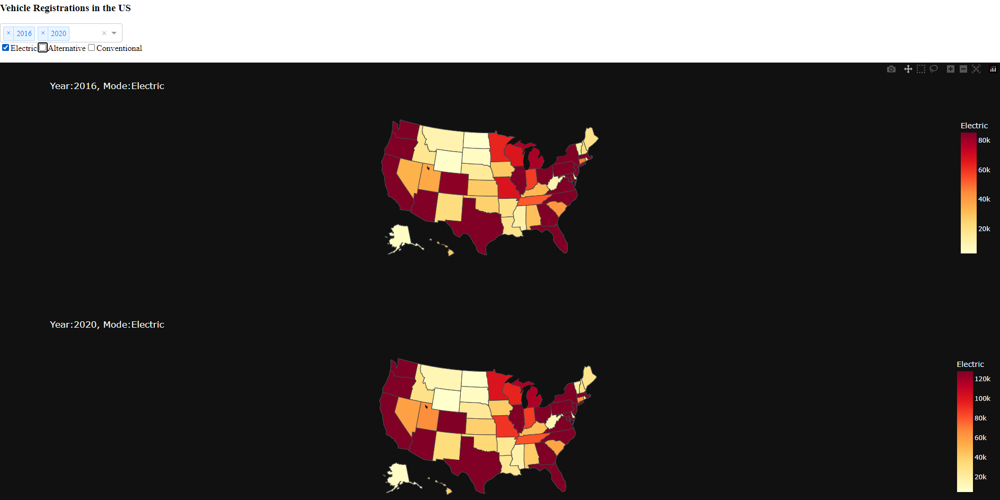

## Vehicle Registration Dashboard

This dashboard visualizes vehicle registration data in the US. It allows users to select a year and vehicle mode (Electric, Alternative, Conventional) to display on a choropleth map.

## Requirements

- Python >=3.6 
- pandas
- plotly
- dash
- us

## Installation

1. Clone this repository.
2. Install the required packages using pip:
```bash
pip install pandas plotly dash us 
```

## Usage

```
python main.py
```

The dashboard will be available at [http://127.0.0.1:8050/](http://127.0.0.1:8050/).

## Features

- Dropdown to select the year of data to display.
- Checklist to select the mode to display.
- Choropleth maps to visualize the selected data.
- Hover over a state to see the number of registrations for the selected mode.

Here'a an screenshot of the dashboard:



## Dataset
The dataset used in this project is from [U.S Department of Energy](https://afdc.energy.gov/vehicle-registration). It contains vehicle registration data for all the states for the years 2016 - 2022. The dataset includes the total number of registrations for Electric, Alternative and Conventional Vehicles.

